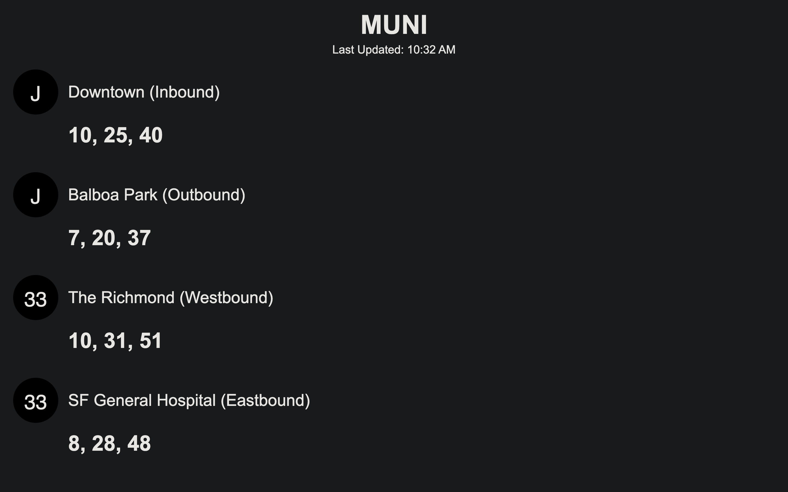

# 🌁 SF Real-Time Transit Dashboard

<p align='center'>
    
</p>

## 🚊 Overview
A Python transit dashboard that pulls real-time MUNI arrivals of lines closest to my home from the 511.org API. It runs as a simple script and can also run on a Raspberry Pi with an e-ink display. The project builds on u/valleyman86’s [Reddit post](https://www.reddit.com/r/sanfrancisco/comments/1jx4z61/i_made_this_muni_board_in_the_last_34_days/) and [Github repo](https://github.com/valleyman86/muni-display) with cleaner architecture, stronger API handling, and improved operations. I plan to expand it into a small web app where anyone can enter any stop.

> <b>Stack</b>: Python • Jinja2 • 511.org API • JSON • HTML/CSS • DevTools • Automation

## 🚇 Why I Built This
My partner and I ride MUNI daily and wanted a small screen at home that displays J-Church and 33-Ashbury arrivals at a glance without pulling out our phones. The display updates regularly within token limits and works on an iPad or future e-ink setup. The project also serves as a practical demo of my Python and Support Engineering skills while solving a real need.

## 🧠 Skills Demonstrated
This project intentionally includes several employer-relevant skills commonly expected in Support Engineer, Developer Support, and SRE-adjacent roles:

### API + Data Skills
* REST API integration (511.org)
* Postman API testing + documentation (included in roadmap)
* JSON parsing and validation
* Timezone handling and UTC → PST conversion
* API error handling, edge cases, and retries (planned)

### Python Engineering Skills
* Clean project structure (src/, dev_tools/, templates/)
* Script automation
* Separation of concerns: client / parser / renderer
* Dependency injection for testable code
* Jinja2 templating for HTML dashboards
* Config management with environment variables
* Dashboard generation pipeline

### Support Engineering Skills
* Logging
* Health checks and debug tools (planned)
* Troubleshooting guide
* Reproducible environments
* Internal dev tooling (fetch_once.py for offline data)
* Clear documentation and setup instructions

### Portfolio / DevEx Skills
* Architecture diagram (planned)
* Small UI (HTML dashboard)
* GitHub-ready structure
* Short video/gif demo (planned)

This project is evolving into a small but complete internal tool.

## 🏗️ Project Architecture (High-Level Overview)
```
main.py               → Entry point: fetch data → parse → build dashboard entries → render output
muni.py               → API client for 511.org + JSON response handling
utils_time.py         → All time utilities (UTC parsing, PST conversion, arrival math)
render_dashboard.py   → Loads HTML template + injects arrival data
config.py             → Stop IDs + global settings (e.g., MAX_ARRIVALS)
templates/            → Dashboard HTML template (e-ink friendly)
dev_tools/            → Tools for testing + caching API responses
sample_data/          → Cached API responses for offline debugging
```
### Data Flow
```
API → JSON → parsed arrivals → entries list → dashboard.html
```

## 🔧 Setup
#### 0. Clone the repo
```
git clone https://github.com/nathantorento/muni-tracker-display
cd muni-tracker-display

# (Optional) Set up a virtual environment to isolate project dependencies and avoid conflicts
python3 -m venv venv
```
#### macOS/Linux
```
source venv/bin/activate
```
#### Windows
```
venv\Scripts\activate
```


#### 1. Install project dependencies
```
pip install -r requirements.txt
```
#### 2. Create an .env file
You need your own API token from 511.org so get one here: https://511.org/open-data/token

Your .env file should look something like this:
```
MUNI_API_KEY=xxxxxxxx-xxxx-xxxx-xxxx-xxxxxxxxxxxx
```
#### 3. Run the dashboard generator
From your project root:
```
python3 -m src.main
```
This will then output a dashboard.html file that, by default, displays the next 3 arrivals for each of these stops. 
* J Inbound
* J Outbound
* 33 Westbound
* 33 Eastbound

<b>Open "dashboard.html".</b> Remember that you are limited per API token to 60 requests every 1 hour (3600 seconds).

## 🖥️ Dashboard Preview
The dashboard uses simple black-and-white HTML and large readable text to make it compatible with:
* iPads
* tablets
* laptops
* future Raspberry Pi + Waveshare e-ink displays
It uses zero Javascript, making it friendly for e-ink rendering.

## 🧰 Developer Tools
### Fetch a one-time snapshot of the API
(To be used when debugging offline)
```
python3 -m dev_tools.fetch_once
```
This updates the cached JSON in sample_data/.

More dev tools coming:
* health_check.py
* debug_times.py
* cache viewer
* arrival accuracy checker

## 🧭 Roadmap
### Completed
* API integration
* Clean project structure
* Multi-stop dashboard
* Jinja2 HTML renderer
* Offline caching tool
* Timezone support
* 4-stop configuration

### In Progress
* Developer tools for debugging
* Logging + structured errors
* Postman collection + exported tests
* Architecture diagram
* Troubleshooting guide
* Polished GitHub documentation
* Short video demo
* Modular webapp version

### Future
* Raspberry Pi e-ink display support
* Auto-refresh looping script
* Custom user stop-code setup (web interface)